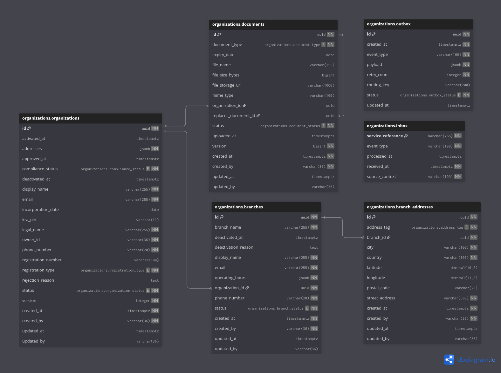

# eBikes Africa — Organizations Service

> Manages the full lifecycle of organizations and their branches within the eBikes Africa dispatch platform — from registration and document verification through to activation, branch management, and ongoing compliance.

---

## Overview

The Organizations service is the authoritative source of organization and branch state within the eBikes Africa platform. It governs the complete onboarding lifecycle of a delivery organization, from initial registration and document submission through to maker-checker approval, activation, and branch provisioning. All downstream services that act on behalf of an organization depend on the identity and status data owned here.

Organization and document mutations flow through a **maker-checker pattern** — create, update, and document replacement operations are submitted for approval before taking effect. Change tracking is powered by JaVers. Document storage uses AWS S3 via presigned URLs — clients upload directly to S3, then confirm the upload; the service validates and progresses the document state.

**Owns:**

- Organization registration and lifecycle state machine (PENDING_APPROVAL → APPROVED → ACTIVE → DEACTIVATED)
- Maker-checker workflow for organization create, update, and document replacement
- Branch lifecycle management (ACTIVE → SUSPENDED → DEACTIVATED, reinstate)
- Branch address management
- Document upload and confirmation (presigned S3 flow)
- Per-registration-type required document enforcement
- Document replacement with maker-checker approval
- JaVers-backed change detection and field-level audit trail
- Outbox event log and retry management

**Does not own:**

- Agent identity and workforce management — belongs to Workforce Management
- Order creation and dispatch — belongs to Orders
- Assignment strategy — belongs to Assignment
- Payment processing — belongs to Payment & Billing (future)
- Routing and distance calculations — belongs to Routing & Pricing

---

## Platform Context

| Relationship | Service       | How                                                                                  |
|--------------|---------------|--------------------------------------------------------------------------------------|
| Publishes to | All           | Organization, branch, and document lifecycle events via RabbitMQ outbox pattern      |
| Publishes to | Maker-Checker | `MakerCheckerRequest` events for organization create/update and document replacement |
| Consumes     | Maker-Checker | `MakerCheckerDecision` — approval or rejection of pending create/update operations   |
| Auth via     | Keycloak      | JWT / OIDC — all endpoints require Bearer token                                      |
| Storage      | AWS S3        | Document uploads via presigned URL — bucket: `ebikes-organizations-docs-{env}`       |
| Cache        | Redis         | Organization data caching — prefix: `organizations:`, configurable TTL               |

---

## Tech Stack

| Concern         | Technology                        |
|-----------------|-----------------------------------|
| Language        | Java 21                           |
| Framework       | Spring Boot 3.x                   |
| Database        | PostgreSQL (Liquibase migrations) |
| Messaging       | RabbitMQ (outbox pattern)         |
| Auth            | Keycloak (JWT / OIDC)             |
| Storage         | AWS S3 (presigned URLs)           |
| Cache           | Redis                             |
| Change Tracking | JaVers                            |
| API Docs        | SpringDoc / Swagger UI            |

---

## Prerequisites

| Tool           | Version | Notes                                   |
|----------------|---------|-----------------------------------------|
| Java           | 21+     | Use SDKMAN: `sdk install java 21`       |
| Docker         | 20.10+  | Required for all local dependencies     |
| Docker Compose | v2.0+   | Bundled with Docker Desktop             |
| Maven          | 3.9+    | Or use the included `mvnw`              |
| LocalStack     | latest  | S3 emulation for local document uploads |
| Redis          | 7+      | Organization data caching               |

---

```bash
# 1. Copy environment template and configure
cp .env.example .env
# Edit .env — see inline comments for required values

# 2. Start infrastructure dependencies
docker compose up -d

# 3. Run the service
./mvnw spring-boot:run -Dspring-boot.run.profiles=local
```

> **S3:** Document upload requires a running LocalStack instance. The `.env.example` points to `http://localhost:4566` by default. AWS credentials are not required locally — LocalStack accepts any non-empty key and secret.

---

## Running Tests

```bash
# Full verify — mirrors the CI quality gate
./mvnw verify

# Unit tests only
./mvnw test
```

Coverage report: `target/site/jacoco/index.html`

---

## Database Schema



---

## Environments & Deployment

| Environment  | Trigger                         | Image tag           |
|--------------|---------------------------------|---------------------|
| `dev`        | Push to `dev` (after CI passes) | `dev` + `sha-*`     |
| `staging`    | Push to `staging` (after CI)    | `staging` + `sha-*` |
| `production` | Release Please semver tag       | `vX.Y.Z` + `sha-*`  |

Images are published to AWS ECR. CI pipeline: `.github/workflows/`
